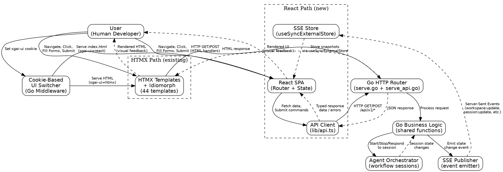

# React Migration Plan: HTMX+PicoCSS → React 19 + shadcn/ui

## Executive Summary

This document is a comprehensive migration plan for rewriting the SGAI presentation layer from HTMX+PicoCSS (server-rendered HTML templates) to a React 19 Single Page Application (SPA) with shadcn/ui components.

**What:** Replace all 44 HTMX HTML templates in `cmd/sgai/templates/` with a React 19 SPA located at `cmd/sgai/webapp/`, using shadcn/ui for UI components, Tailwind CSS v4 for styling, and bun as the build tool. The Go backend gains a new `/api/v1/*` JSON API layer, while keeping existing HTMX handlers intact during migration.

**Why:**
- The current HTMX interface feels sluggish and unresponsive during complex operations
- Need for richer interactions (drag-and-drop, inline editing, real-time updates without polling)
- Proactive modernization to improve developer experience and enable future enhancements
- React's component model enables better code reuse and testing

**Strategy:** A vertical-slice migration approach — each milestone migrates one complete functional area end-to-end (Go API + React pages + tests). A cookie-based UI switcher (`sgai-ui` cookie) allows both HTMX and React versions to run simultaneously, with automated Playwright feature parity tests ensuring no regressions.

**Key Constraints:**
- No authentication — SGAI is a local developer tool
- Client-only SPA — no server-side rendering
- React build output embedded in Go binary via `//go:embed`
- Modern browsers only (Chrome/Edge/Firefox latest)

---

## Consolidated Requirements

The following requirements were established through a structured brainstorming session with 16 questions across 4 rounds:

| # | Aspect | Decision | Notes |
|---|--------|----------|-------|
| Q1 | Migration Scope | Full rewrite — all 44 templates | No partial migration |
| Q2 | Backend API Strategy | New `/api/v1/*` JSON layer | Coordinator's recommendation based on codebase analysis |
| Q3 | Real-time Updates | Server-Sent Events (SSE) | Replaces current 2-second HTMX polling |
| Q4 | Build & Deployment | Embed `dist/` in Go binary via `//go:embed` | Single binary deployment preserved |
| Q5 | Side-by-Side Serving | Cookie-based UI switcher | Both versions accessible simultaneously |
| Q6 | Visual Design | shadcn/ui components | Clean, accessible defaults with Tailwind v4 |
| Q7 | State Management | Lightweight: React Context + SSE | Minimal dependencies, no Redux/Zustand |
| Q8 | Testing Strategy | 4-tier testing | Unit, Component, E2E (Playwright), Go API |
| Q9 | Dependency Freshness | Belt-and-suspenders | CI check, Dependabot, Makefile, lock audit, scheduled runs |
| Q10 | STPA Analysis Scope | Comprehensive — all 4 safety areas | Data loss, workflow disruption, state inconsistency, migration regression |
| Q11 | Authentication | None | Local developer tool |
| Q12 | Browser Support | Modern only | Chrome/Edge/Firefox latest; no IE/Safari legacy |
| Q13 | Migration Priority Order | Coordinator's recommendation | Entity browsers → Dashboard → Session → Response → Composer → Cleanup |
| Q14 | Current UI Pain Points | Sluggish UI, need richer interactions, proactive modernization | Multiple motivators |
| Q15 | Feature Parity | Parity + minor UX improvements | Where React naturally enables them |
| Q16 | React Router Strategy | Same URL structure + deep links | Bookmarkable URLs preserved |

**Additional Requirements Surfaced During Brainstorming:**
- Deep link support: users must be able to copy, paste, and bookmark URLs in the browser
- Steps to guarantee dependencies are always up to date

---

## Project Structure & Build Pipeline

### Directory Layout

```
cmd/sgai/
├── webapp/                    # React SPA (bun project)
│   ├── package.json           # bun deps (react, react-dom, react-router, tailwindcss, shadcn)
│   ├── bun.lock               # lock file
│   ├── tsconfig.json           # TypeScript config
│   ├── build.ts               # bun build script (Bun.build() config)
│   ├── dev.ts                 # bun dev server (Bun.serve() + watch + proxy to Go API)
│   ├── index.html             # SPA entry point
│   ├── src/
│   │   ├── main.tsx           # React entry, router setup
│   │   ├── App.tsx            # Root component, SSE provider, layout
│   │   ├── router.tsx         # React Router config (same URLs as current)
│   │   ├── components/        # Shared shadcn + custom components
│   │   │   └── ui/            # shadcn components (auto-generated)
│   │   ├── pages/             # Route-level page components
│   │   │   ├── Dashboard/
│   │   │   ├── Workspace/
│   │   │   ├── Compose/
│   │   │   └── ...
│   │   ├── hooks/             # Custom hooks (useSSE, useWorkspace, etc.)
│   │   ├── contexts/          # React Context providers
│   │   ├── lib/               # API client, utilities
│   │   │   ├── api.ts         # Typed API client
│   │   │   └── sse-store.ts   # SSE external store (useSyncExternalStore)
│   │   └── types/             # TypeScript type definitions
│   └── dist/                  # Build output (git-ignored)
├── webapp_embed.go            # NEW: //go:embed webapp/dist/*
├── serve.go                   # EXISTING: untouched during migration
├── serve_api.go               # NEW: /api/v1/* JSON handlers
├── templates/                 # EXISTING: HTMX templates (kept during migration)
└── ...
```

### Build Pipeline

**Bundler:** `bun build` (native) — bun's native bundler, not Vite.

| Command | Purpose |
|---------|---------|
| `bun build ./src/main.tsx --outdir ./dist --splitting --minify` | Production build |
| `bun run dev.ts` | Dev server (`Bun.serve()` with watch + proxy to Go API on `:8181`) |

**Tailwind CSS v4** uses the Rust-based engine (no PostCSS needed).

**Go Embedding:**
```go
// webapp_embed.go
//go:embed webapp/dist/*
var webappDist embed.FS
```

The build output is embedded into the Go binary, preserving the single-binary deployment model.

**Makefile Integration:**
```makefile
build: lint webapp-build
    go build -o ./bin/sgai ./cmd/sgai

webapp-build:
    cd cmd/sgai/webapp && bun install && bun run build

webapp-test:
    cd cmd/sgai/webapp && bun test

test: webapp-test
    go test -v ./...
    $(MAKE) lint

webapp-check-deps:
    cd cmd/sgai/webapp && bun outdated

lint:
    golangci-lint run ./...
```

---

## Architecture Decisions

### 1. Cookie-Based UI Switcher

Both the existing HTMX interface and the new React SPA are served from the same Go binary at the same URL paths. A cookie determines which one the user sees:

1. Cookie `sgai-ui=htmx` (default) or `sgai-ui=react`
2. Go middleware checks the cookie on each request:
   - `htmx` → renders HTML template (existing behavior, unchanged)
   - `react` → serves `index.html` from embedded React `dist/` (React Router handles routing client-side)
3. A toggle button exists in both UIs to set the cookie and reload the page
4. Deep links always work — same URLs for both versions, bookmarks survive migration
5. When migration is complete (M7): remove cookie logic + HTMX templates, React becomes the only path

### 2. JSON API Layer (`/api/v1/*`)

A new file `serve_api.go` introduces JSON endpoints under `/api/v1/`. These endpoints **share business logic** with existing HTMX handlers — functions are extracted from `serve.go` into shared helpers, not reimplemented.

**Key Endpoints:**

| Method | Endpoint | Description |
|--------|----------|-------------|
| `GET` | `/api/v1/workspaces` | List workspaces |
| `GET` | `/api/v1/workspaces/{name}` | Workspace detail + session state |
| `POST` | `/api/v1/workspaces` | Create workspace |
| `POST` | `/api/v1/workspaces/{name}/start` | Start session |
| `POST` | `/api/v1/workspaces/{name}/stop` | Stop session |
| `POST` | `/api/v1/workspaces/{name}/respond` | Respond to agent question |
| `GET` | `/api/v1/events/stream` | SSE endpoint (replaces polling) |
| `GET` | `/api/v1/agents` | List agents |
| `GET` | `/api/v1/skills[/{name}]` | Skills list/detail |
| `GET` | `/api/v1/snippets[/{lang}]` | Snippets list/detail |
| `GET` | `/api/v1/compose` | GOAL composer data |
| `POST` | `/api/v1/compose` | Save GOAL.md |

Additional endpoints grow per milestone. The HTMX handlers in `serve.go` remain completely untouched — both versions work simultaneously.

### 3. SSE with `useSyncExternalStore`

> **Source:** [React `useSyncExternalStore` Reference](https://react.dev/reference/react/useSyncExternalStore) — React's official hook for subscribing to external data stores.

The SSE infrastructure follows React's recommended pattern for external data sources:

**SSE Store (`lib/sse-store.ts`):**
A standalone TypeScript module manages the `EventSource` connection as an external store:
- Creates an external store with `subscribe`/`getSnapshot` functions
- Components subscribe via `useSyncExternalStore(store.subscribe, store.getSnapshot)`
- Handles connection, reconnection with exponential backoff (1s → 2s → 4s → max 30s), typed event parsing
- **NOT** in React Context — it's an external store per React docs recommendations
- Server endpoint: `GET /api/v1/events/stream` (`text/event-stream`)

**Typed SSE Event Names:**

| Event | Meaning |
|-------|---------|
| `workspace:update` | Workspace list/detail changed |
| `session:update` | Session status, current agent, workflow state |
| `messages:new` | New inter-agent message |
| `todos:update` | Todo list changed |
| `log:append` | New output log lines |
| `changes:update` | JJ diff changed |
| `events:new` | New progress event |
| `compose:update` | GOAL.md composer state |

### 4. App State with `useReducer` + Context

> **Source:** [Scaling Up with Reducer and Context](https://react.dev/learn/scaling-up-with-reducer-and-context) — React's recommended pattern for complex app state management.

```
<AppStateProvider>              // Single useReducer + Context
  <Router />                    // React Router
</AppStateProvider>
```

The reducer handles actions: `workspace/select`, `ui/togglePanel`, `ui/setTab`. SSE events dispatch actions into this reducer to update state, ensuring a single source of truth.

### 5. React 19 `use()` + Suspense for Data Fetching

> **Source:** [React `use()` Reference](https://react.dev/reference/react/use) — React 19's API for reading Promises within components, enabling Suspense-based data loading.

- Pages wrapped in `<Suspense fallback={<Skeleton />}>`
- Initial fetch via `use(fetchWorkspaces())`
- SSE then keeps data fresh via `useSyncExternalStore`
- No component renders without data — skeletons shown during loading

### Custom Hooks (Public API)

```typescript
// SSE subscription
useSSEEvent(eventType)           // useSyncExternalStore subscription

// App state
useAppState()                    // useReducer context (read state)
useAppDispatch()                 // useReducer context (dispatch actions)

// Domain-specific (combine fetch + SSE)
useWorkspaces()                  // workspaces list with SSE updates
useSession(name)                 // workspace session with SSE updates
useMessages(name)                // agent messages
useTodos(name)                   // todo list
useLog(name)                     // output log stream
useAgents()                      // agent definitions
useSkills()                      // skill list + detail
useSnippets()                    // snippet list + detail
```

---

## Milestones

**Approach:** Vertical Slices — each milestone is a complete vertical slice: Go API endpoints + React pages + tests. Every milestone leaves the app fully working.

### M0: Foundation

**Goal:** Scaffold the React project and infrastructure. No user-visible features yet.

**Deliverables:**
- Scaffold React project in `cmd/sgai/webapp/` (bun init, React 19, TypeScript, Tailwind v4, shadcn)
- `build.ts` (Bun.build config) + `dev.ts` (Bun.serve dev server with proxy)
- `webapp_embed.go` with `//go:embed webapp/dist/*`
- Cookie-based UI switcher in Go (`sgai-ui` cookie)
- SPA fallback handler (serves `index.html` for all routes when `sgai-ui=react`)
- SSE endpoint: `GET /api/v1/events/stream`
- SSE store module (`lib/sse-store.ts` using `useSyncExternalStore` pattern)
- `AppStateProvider` with `useReducer`
- React Router config matching current URL structure
- Makefile: `build` runs `bun run build` before `go build`
- Dependabot config for JS deps

**API Endpoints:** `GET /api/v1/events/stream`

**React Pages:** App shell with router (no content pages yet)

**Templates Replaced:** None (foundation only)

**shadcn Components:** None (foundation only)

**STPA-Derived Exit Criteria:**
- [ ] SSE Store implements auto-reconnect with exponential backoff (R-1, R-3)
- [ ] SSE endpoint supports snapshot mode for initial connect (R-19)
- [ ] React UI shows connection status indicator (R-2)
- [ ] SPA catch-all handler correctly excludes `/api/v1/*` routes (R-12, R-23)
- [ ] Build pipeline enforces bun build → go build ordering with manifest (R-13)
- [ ] Cookie switch triggers full page reload (R-16)
- [ ] Deep link test: direct URL access to `/workspaces/test` returns React shell (R-12)

**Standard Exit Criteria:**
- [ ] Toggle cookie → see blank React app shell with router; SSE connects
- [ ] HTMX version continues working unchanged

**Feature Parity Check:** N/A (no migrated features yet)

---

### M1: Entity Browsers

**Goal:** Migrate the simplest pages (read-only entity lists) to validate the full pipeline end-to-end.

**API Endpoints:**
| Method | Endpoint |
|--------|----------|
| `GET` | `/api/v1/agents` |
| `GET` | `/api/v1/skills` |
| `GET` | `/api/v1/skills/{name}` |
| `GET` | `/api/v1/snippets` |
| `GET` | `/api/v1/snippets/{lang}` |

**React Pages:** `AgentList`, `SkillList`, `SkillDetail`, `SnippetList`, `SnippetDetail`

**Templates Replaced:**
- `agents.html`
- `skills.html`
- `skill_detail.html`
- `snippets.html`
- `snippet_detail.html`

**shadcn Components:** Card, Table, Tabs, ScrollArea, Badge

**STPA-Derived Exit Criteria:**
- [ ] Unmigrated areas show "Not Yet Available" with one-click switch back (R-6)
- [ ] Playwright parity tests pass for entity browser flows on both cookies (R-7)
- [ ] All page components use Suspense boundaries for initial load (R-17)

**Standard Exit Criteria:**
- [ ] Entity browsers fully functional in React
- [ ] HTMX versions still work via cookie toggle

**Feature Parity Check:** Playwright tests run identical entity browsing flows with both `sgai-ui=htmx` and `sgai-ui=react` cookies, comparing page content and navigation behavior.

---

### M2: Main Dashboard + Workspace Tree

**Goal:** Migrate the core landing experience — workspace tree sidebar with real-time updates.

**API Endpoints:**
| Method | Endpoint |
|--------|----------|
| `GET` | `/api/v1/workspaces` |
| `GET` | `/api/v1/workspaces/{name}` |
| `POST` | `/api/v1/workspaces` |

Plus SSE events for workspace changes.

**React Pages:** `Dashboard` (workspace tree sidebar), `WorkspaceDetail`, `EmptyState`

**Templates Replaced:**
- `trees.html`
- `trees_content.html`
- `trees_workspace.html`
- `trees_root_workspace.html`
- `trees_no_workspace.html`

**Layout:** Sidebar + main content area (shadcn Sidebar, ResizablePanel)

**shadcn Components:** Sidebar, ResizablePanel, Button, Input, Dialog

**STPA-Derived Exit Criteria:**
- [ ] No optimistic updates for workspace creation — use loading states (R-11)
- [ ] Playwright parity tests for dashboard/workspace tree (R-7)
- [ ] SSE `workspace:update` events arrive after state commit (R-5)

**Standard Exit Criteria:**
- [ ] Full workspace tree with real-time updates via SSE
- [ ] Workspace selection + deep links work

**Feature Parity Check:** Playwright tests verify workspace tree rendering, workspace selection, workspace creation, and real-time update behavior on both cookie values.

---

### M3: Session Tabs

**Goal:** Migrate the richest content area — all session information tabs.

**API Endpoints:**
| Method | Endpoint |
|--------|----------|
| `GET` | `/api/v1/workspaces/{name}/session` |
| `GET` | `/api/v1/workspaces/{name}/messages` |
| `GET` | `/api/v1/workspaces/{name}/todos` |
| `GET` | `/api/v1/workspaces/{name}/log` |
| `GET` | `/api/v1/workspaces/{name}/changes` |
| `GET` | `/api/v1/workspaces/{name}/events` |
| `GET` | `/api/v1/workspaces/{name}/forks` |
| `GET` | `/api/v1/workspaces/{name}/retrospectives` |

**React Pages:** `SessionTab`, `SpecificationTab`, `MessagesTab`, `LogTab`, `RunTab`, `ChangesTab`, `EventsTab`, `ForksTab`, `RetrospectivesTab`

**Templates Replaced:**
- `trees_session_content.html`
- `trees_specification_content.html`
- `trees_messages_content.html`
- `trees_log_content.html`
- `trees_run_content.html`
- `trees_changes_content.html`
- `trees_events_content.html`
- `trees_forks_content.html`
- `trees_retrospectives_content.html`
- `trees_retrospectives_apply_select.html`

**shadcn Components:** Tabs, DataTable, Badge, Tooltip, Accordion

SSE events for real-time session/log/message updates.

**STPA-Derived Exit Criteria:**
- [ ] All mutating endpoints (start/stop) are idempotent (R-10)
- [ ] Loading states for all agent control commands (R-11)
- [ ] SSE events emitted via structural middleware, not manual calls (R-4)
- [ ] Playwright parity tests for all session tab flows (R-7)

**Standard Exit Criteria:**
- [ ] All session tabs render correctly with live updates

**Feature Parity Check:** Playwright tests compare all tab contents, tab switching, and real-time update behavior on both cookie values.

---

### M4: Response System

**Goal:** Migrate agent interaction — responding to questions, start/stop/reset controls.

**API Endpoints:**
| Method | Endpoint |
|--------|----------|
| `POST` | `/api/v1/workspaces/{name}/respond` |
| `GET` | `/api/v1/workspaces/{name}/pending-question` |
| `POST` | `/api/v1/workspaces/{name}/start` |
| `POST` | `/api/v1/workspaces/{name}/stop` |
| `POST` | `/api/v1/workspaces/{name}/reset` |

**React Pages:** `ResponseMultiChoice`, `ResponseModal`, `ResponseContext`

**Templates Replaced:**
- `response_multichoice.html`
- `response_multichoice_modal.html`
- `response_context.html`
- `trees_actions.html`
- `trees_root_actions.html`
- `trees_reset_banner.html`

**shadcn Components:** Dialog, RadioGroup, Textarea, Button, Alert

**STPA-Derived Exit Criteria:**
- [ ] Response input persisted to sessionStorage on keystroke (R-8)
- [ ] `beforeunload` warning when response has unsaved text (R-9)
- [ ] Respond endpoint validates question ID freshness (R-21)
- [ ] Mutation buttons disabled during in-flight requests (R-18)
- [ ] Playwright parity tests for response flows (R-7)

**Standard Exit Criteria:**
- [ ] Can interact with agents (respond to questions, start/stop sessions) entirely in React

**Feature Parity Check:** Playwright tests verify response submission, start/stop/reset controls, and question display on both cookie values.

---

### M5: GOAL Composer Wizard

**Goal:** Migrate the most complex form — the multi-step GOAL.md creation wizard.

**API Endpoints:**
| Method | Endpoint |
|--------|----------|
| `GET` | `/api/v1/compose` |
| `POST` | `/api/v1/compose` |
| `GET` | `/api/v1/compose/templates` |
| `GET` | `/api/v1/compose/preview` |
| `POST` | `/api/v1/compose/draft` |

**React Pages:** `ComposeLanding`, `WizardStep1`, `WizardStep2`, `WizardStep3`, `WizardStep4`, `WizardFinish`, `ComposePreview`

**Templates Replaced:**
- `compose_landing.html`
- `compose_wizard_base.html`
- `compose_wizard_step1.html`
- `compose_wizard_step2.html`
- `compose_wizard_step3.html`
- `compose_wizard_step4.html`
- `compose_wizard_finish.html`
- `compose_preview.html`
- `compose_preview_partial.html`

**shadcn Components:** Form, Select, Textarea, Stepper, Dialog

**STPA-Derived Exit Criteria:**
- [ ] Wizard state persisted to sessionStorage per step (R-14)
- [ ] Wizard URL reflects current step for deep linking (R-14)
- [ ] Auto-save draft every 30s with "Draft saved" indicator (R-15)
- [ ] `beforeunload` warning when wizard has unsaved progress (R-9)
- [ ] GOAL.md save uses optimistic locking/etag (R-24)
- [ ] Playwright parity tests for full wizard flow (R-7)

**Standard Exit Criteria:**
- [ ] Full GOAL.md creation wizard works in React

**Feature Parity Check:** Playwright tests run the complete wizard flow (all steps, preview, save) on both cookie values, verifying identical results.

---

### M6: Workspace Management + Remaining

**Goal:** Migrate all remaining templates — fork/merge/rename, ad-hoc prompts, retrospective analyze/apply.

**API Endpoints:**
| Method | Endpoint |
|--------|----------|
| `POST` | `/api/v1/workspaces/{name}/fork` |
| `POST` | `/api/v1/workspaces/{name}/merge` |
| `POST` | `/api/v1/workspaces/{name}/rename` |
| `PUT` | `/api/v1/workspaces/{name}/goal` |
| `POST` | `/api/v1/workspaces/{name}/adhoc` |
| `POST` | `/api/v1/workspaces/{name}/retrospective/analyze` |
| `POST` | `/api/v1/workspaces/{name}/retrospective/apply` |

**React Pages:** `NewWorkspace`, `NewFork`, `RenameFork`, `EditGoal`, `AdhocOutput`, `RetroAnalyze`, `RetroApply`

**Templates Replaced:** Remaining ~8 templates

**shadcn Components:** Form, Dialog, Alert, Select

**STPA-Derived Exit Criteria:**
- [ ] All mutation endpoints have deduplication (R-18)
- [ ] Playwright parity tests for remaining flows (R-7)

**Standard Exit Criteria:**
- [ ] ALL 44 templates have React equivalents

**Feature Parity Check:** Playwright tests verify all remaining functionality (fork, merge, rename, edit goal, ad-hoc, retrospectives) on both cookie values.

---

### M7: Polish + HTMX Removal

**Goal:** Finalize the migration — remove all HTMX code, make React the sole interface.

**Deliverables:**
- Default cookie to `react`, test all pages thoroughly
- Remove HTMX templates, PicoCSS, Idiomorph
- Remove cookie switcher logic
- Remove old HTML handlers (keep only `/api/v1/*`)
- Performance audit, accessibility review

**API Endpoints:** None new (cleanup only)

**React Pages:** None new (polish only)

**Templates Replaced:** All remaining HTMX infrastructure removed

**STPA-Derived Exit Criteria:**
- [ ] Full Playwright test suite passes on React-only (R-7)
- [ ] Headless smoke test validates embedded `dist/` mounts (R-22)
- [ ] All deep link patterns tested via Playwright (R-12)
- [ ] SSE connection resilience tested (network drop simulation) (R-1, R-3)

**Standard Exit Criteria:**
- [ ] Single React SPA, no HTMX code remains, all tests pass

**Feature Parity Check:** Final Playwright test suite runs all user flows on React-only, verifying complete feature parity with the former HTMX interface (baseline screenshots/assertions captured before removal).

---

## STPA Analysis Results

A comprehensive System Theoretic Process Analysis (STPA) was performed covering four safety areas: data loss, workflow disruption, state inconsistency, and migration regression.

### Step 1: Purpose Definition

#### Losses

| ID | Loss | Severity |
|----|------|----------|
| L-1 | Loss of user work product — unsaved GOAL.md edits, in-progress compose wizard state, agent response text lost during UI switch or page reload | Serious |
| L-2 | Workflow disruption — agent orchestration session interrupted, requiring restart of multi-agent workflow that may have been running for hours | Serious |
| L-3 | State inconsistency — React UI shows stale/incorrect data while Go backend has different state, leading to user making wrong decisions about agent workflow | Serious |
| L-4 | Migration regression — existing HTMX functionality broken during React development, leaving users without a working interface | Serious |
| L-5 | Loss of deep link integrity — bookmarked/shared URLs stop working during or after migration, disrupting developer workflows | Moderate |

#### Hazards

| ID | Hazard | Linked Losses |
|----|--------|---------------|
| H-1 | React UI renders stale workspace/session data while backend state has changed | L-3 |
| H-2 | Cookie-based UI switcher routes user to React SPA that lacks functionality available in HTMX version | L-4 |
| H-3 | SSE connection drops without reconnection, leaving React UI frozen with stale data | L-1, L-3 |
| H-4 | React SPA loses unsaved form state (compose wizard, response input, GOAL editor) on page reload or route change | L-1 |
| H-5 | API endpoint (`/api/v1/*`) returns different data/format than HTMX handler for same business logic | L-3, L-4 |
| H-6 | React Router handles URLs differently than Go server, breaking deep links | L-5 |
| H-7 | Agent session start/stop/respond commands from React UI fail silently, corrupting workflow state | L-2 |
| H-8 | Side-by-side serving causes resource conflicts (both UIs trying to control same session) | L-2, L-3 |
| H-9 | Build pipeline failure embeds stale React `dist/` into Go binary | L-4 |
| H-10 | SSE event schema mismatch between Go backend and React TypeScript types | L-3 |

#### System-Level Constraints

| ID | Constraint | Addresses |
|----|-----------|-----------|
| SC-1 | React UI must always reflect current backend state within ≤3s | H-1 |
| SC-2 | Cookie-based UI switcher must never route to React SPA for functionality not yet migrated | H-2 |
| SC-3 | SSE connection must auto-reconnect with exponential backoff and state rehydration | H-3 |
| SC-4 | React SPA must preserve form state across route changes; warn before navigation away from unsaved changes | H-4 |
| SC-5 | API endpoints must share business logic with HTMX handlers — extract into common functions, not reimplement | H-5 |
| SC-6 | React Router URL structure must exactly match current HTMX URLs; Go server must serve `index.html` for all SPA routes | H-6 |
| SC-7 | React UI must provide visible feedback for all agent control commands and surface errors prominently | H-7 |
| SC-8 | Only one UI version can issue mutating commands for a given session at a time | H-8 |
| SC-9 | Build pipeline must verify React `dist/` is fresh before embedding into Go binary | H-9 |
| SC-10 | SSE event types must be defined in a shared schema with validation on both Go emit and TypeScript receive | H-10 |

### Step 2: Control Structure

#### Controllers

1. **User (Human Developer)** — Highest authority. Makes decisions, interacts with UI, provides agent responses.
2. **Cookie-Based UI Switcher** — Go middleware that routes requests based on `sgai-ui` cookie value.
3. **React SPA** — Client-side router + state management + rendering. Includes React Router, AppStateProvider.
4. **React SSE Store** — External store managing `EventSource` connection. Provides `useSyncExternalStore` integration.
5. **API Client (`lib/api.ts`)** — TypeScript module making HTTP requests to Go backend `/api/v1/*`.
6. **Go HTTP Router** — `serve.go` (HTMX handlers) + `serve_api.go` (JSON handlers). Routes to correct handler.
7. **Go Business Logic** — Shared functions extracted from `serve.go`. Processes commands, manages state.
8. **Agent Orchestrator** — Manages multi-agent workflow sessions, agent messaging, workflow state.
9. **SSE Publisher** — Go component that sends server-sent events to connected `EventSource` clients.

#### Control Structure Diagram



#### Critical Feedback Gaps

1. **SSE connection status invisible to user** — No UI indicator showing whether SSE is connected, disconnected, or reconnecting. User cannot tell if data is fresh.
2. **No explicit command acknowledgment** — Mutating API calls return success/failure but no explicit acknowledgment that the action was fully processed by Agent Orchestrator.
3. **Cookie switcher is stateless** — No feedback about which features are available in React version at current milestone.
4. **No API contract drift detection** — No automated check that `/api/v1/*` JSON responses match what React TypeScript types expect.

### Step 3: Unsafe Control Actions

| # | Control Action | Not Provided | Provided Incorrectly | Wrong Timing | Wrong Duration |
|---|---------------|-------------|---------------------|--------------|----------------|
| CA-1 | User sets UI cookie | N/A | **UCA-1:** Switch to React before feature migrated → H-2 | **UCA-2:** Switch mid-session → H-8, H-1 | N/A |
| CA-2 | React SPA dispatches API request | **UCA-3:** No fetch on mount → H-1 | **UCA-4:** Duplicate mutating commands → H-7 | **UCA-5:** Command on stale state → H-3 | N/A |
| CA-3 | SSE Store connects/reconnects | **UCA-6:** No reconnect after drop → H-3, H-1 | N/A | **UCA-7:** Reconnect without rehydration → H-1, H-3 | N/A |
| CA-4 | Go backend publishes SSE event | **UCA-8:** State change without event → H-1, H-3 | N/A | **UCA-9:** Event before commit → H-3 | N/A |
| CA-5 | User submits agent response | **UCA-10:** Response lost on navigation → H-4 | N/A | **UCA-11:** Response after expiry → H-7 | N/A |
| CA-6 | Build embeds React dist/ | **UCA-12:** Stale dist/ embedded → H-9 | **UCA-13:** Broken dist/ embedded → H-4, H-2 | N/A | N/A |
| CA-7 | Router serves index.html | **UCA-14:** No SPA fallback → H-6 | **UCA-15:** SPA intercepts API → H-5 | N/A | N/A |
| CA-8 | Wizard saves GOAL.md | **UCA-16:** Lost wizard progress → H-4, L-1 | N/A | **UCA-17:** Concurrent saves → L-1, H-3 | N/A |

**Priority Summary:** 8 High Priority UCAs (UCA-1, 5, 6, 8, 10, 12, 14, 16), 9 Medium Priority.

### Step 4: Loss Scenarios and Recommendations

#### High Priority Scenarios

**UCA-6: SSE Store does not reconnect after connection drop [→ H-3, H-1]**

*Scenario 6a:* User's laptop switches WiFi networks or wakes from sleep. `EventSource` fires 'error' event but SSE Store has no reconnection logic. React UI continues showing last known state indefinitely. User makes decisions based on stale data.

*Scenario 6b:* Go server restarts. SSE connection drops. If reconnect gives up, user is stuck with stale UI.

**UCA-8: Go backend changes state but fails to emit SSE event [→ H-1, H-3]**

*Scenario 8a:* Developer adds new functionality that mutates state but forgets SSE event emission. This is the most likely scenario — SSE publishing is a cross-cutting concern that's easy to miss.

**UCA-1: User switches to React UI while area not yet migrated [→ H-2]**

*Scenario 1a:* User toggles to React via cookie, expecting all features. React SPA shows blank pages for unmigrated areas. No warning given.

**UCA-10: User response text lost due to navigation/reload [→ H-4]**

*Scenario 10a:* User types a long response. React Router navigation causes component unmount. Response text gone — only in local state.

**UCA-5: React SPA sends command based on stale state [→ H-3]**

*Scenario 5a:* User sees "Session: Idle" and clicks "Start Session". Between click and API call, an SSE event arrives showing session already started. Race condition.

**UCA-12: Go binary embeds stale React dist/ [→ H-9]**

*Scenario 12a:* Developer runs `go build` without `bun build`. Old `dist/` gets embedded.

**UCA-14: Go router doesn't serve index.html for SPA sub-routes [→ H-6]**

*Scenario 14a:* User bookmarks `/workspaces/my-project/session` and navigates directly. Go router returns 404 instead of serving `index.html`.

**UCA-16: Compose wizard loses multi-step progress [→ H-4, L-1]**

*Scenario 16a:* User is on step 3 of 4 in wizard. Clicks sidebar to check something. Returns to find wizard reset to step 1.

### Recommendation Summary

| ID | Recommendation | Addresses UCAs | Priority | Milestone |
|----|---------------|----------------|----------|-----------|
| R-1 | SSE auto-reconnect with exponential backoff (1s → 2s → 4s → max 30s) + snapshot rehydration on reconnect | UCA-6, UCA-7 | **High** | M0 |
| R-2 | Visible SSE connection status banner ("Reconnecting...") when disconnected >2s | UCA-6 | **High** | M0 |
| R-3 | Unbounded SSE reconnection (never give up), progressively slower retries | UCA-6 | **High** | M0 |
| R-4 | Structural SSE event emission via middleware/wrapper — don't rely on manual publish calls | UCA-8 | **High** | M0 |
| R-5 | Post-commit SSE event publishing (after successful state mutations, not during) | UCA-8, UCA-9 | **High** | M0 |
| R-6 | "Not Yet Available — Switch to Classic UI" pages for unmigrated areas with one-click toggle | UCA-1 | **High** | M1-M6 |
| R-7 | Playwright feature parity tests (identical flows on both cookies) per milestone | UCA-1 | **High** | M1-M7 |
| R-8 | sessionStorage persistence for form inputs (persist on keystroke, clear on submit) | UCA-10, UCA-16 | **High** | M4, M5 |
| R-9 | `beforeunload` warning for unsaved form data | UCA-10, UCA-16 | **High** | M4, M5 |
| R-10 | Idempotent mutating API endpoints (e.g., "Start Session" on running session returns current state) | UCA-4, UCA-5 | **High** | M3, M4 |
| R-11 | No optimistic updates for critical actions — use loading states; update UI from SSE/API only | UCA-5 | **High** | M2-M4 |
| R-12 | SPA catch-all route: serve `index.html` for ANY route when `sgai-ui=react`, EXCEPT `/api/v1/*` and static assets | UCA-14, UCA-15 | **High** | M0 |
| R-13 | Build ordering enforcement in Makefile + build manifest with timestamp | UCA-12 | **High** | M0 |
| R-14 | Wizard state in sessionStorage + URL reflects step (`/compose/step/3`) for deep linking | UCA-16 | **High** | M5 |
| R-15 | Auto-save wizard draft to backend every 30s with "Draft saved" indicator | UCA-16 | Medium | M5 |
| R-16 | Force full page reload on cookie switch | UCA-2 | Medium | M0 |
| R-17 | Suspense + `use()` for all page-level data loading — no component renders without data | UCA-3 | Medium | M1+ |
| R-18 | Client-side mutation deduplication (disable button on click, track in-flight requests) | UCA-4 | Medium | M4, M6 |
| R-19 | SSE snapshot mode: on initial connect/reconnect, send full state as first event, then incremental | UCA-6, UCA-7 | **High** | M0 |
| R-20 | Deferred SSE event publishing (post-transaction-commit) | UCA-9 | Medium | M0 |
| R-21 | Question ID validation on respond endpoint — return "Question expired" if stale | UCA-11 | Medium | M4 |
| R-22 | Headless smoke test (Playwright) before embedding dist/ — verify React shell mounts | UCA-13 | Medium | M7 |
| R-23 | Explicit `/api/v1/*` routing BEFORE SPA catch-all; React Router must NOT define `/api/v1/` routes | UCA-14, UCA-15 | **High** | M0 |
| R-24 | Optimistic locking (etag/version) for GOAL.md saves | UCA-17 | Medium | M5 |

### Analysis Statistics

- **Losses identified:** 5 (L-1 through L-5)
- **Hazards identified:** 10 (H-1 through H-10)
- **System-level constraints:** 10 (SC-1 through SC-10)
- **Unsafe control actions:** 17 (UCA-1 through UCA-17), 8 high priority
- **Loss scenarios analyzed:** 20+ causal pathways
- **Recommendations:** 24 (R-1 through R-24), 14 high priority
- **Critical feedback gaps:** 4

---

## AGENTS.md Update Suggestions

The following 6 additions should be made to `AGENTS.md` to support the React migration:

### 1. Bun Build Tool Directive
```
For React/TypeScript code, use bun for building, testing, and running scripts.
```

### 2. shadcn/ui Component Requirement
```
React components must use shadcn/ui components where possible.
```

### 3. React Testing Directive
```
For tests: React unit tests with bun test (vitest-compatible), E2E with Playwright.
```

### 4. React State Management Patterns
```
Use useSyncExternalStore for external data sources (SSE), useReducer+Context for app state.
```

### 5. Preserve Existing Go Directives
Keep all existing directives intact:
- Go code style rules (no inline comments, private by default, etc.)
- `make lint` requirement
- tmux/playwright testing requirements
- jj for version control

### 6. Build Verification Directive
```
When modifying cmd/sgai/webapp/, run bun run build && make build to verify.
```

---

## Skills Suggestions

Five new skills should be added to the `sgai/` overlay directory:

### 1. `react-sse-patterns`
**Description:** Guide for implementing SSE with `useSyncExternalStore` in this codebase. Covers the external store pattern, reconnection with exponential backoff, snapshot rehydration on reconnect, typed event parsing, and connection status UI indicators. References R-1, R-2, R-3, R-19 from STPA analysis.

### 2. `react-shadcn-component-mapping`
**Description:** Maps current PicoCSS patterns to shadcn/ui equivalents. Provides a lookup table for every PicoCSS element used in the 44 HTMX templates and its shadcn equivalent (e.g., PicoCSS `<details>` → shadcn `Accordion`, PicoCSS `<table>` → shadcn `DataTable`, PicoCSS `role="group"` → shadcn `ButtonGroup`).

### 3. `go-json-api-patterns`
**Description:** Guide for writing `/api/v1/*` JSON endpoints in `serve_api.go` that share business logic with existing HTMX handlers. Covers extracting shared functions from `serve.go`, JSON marshaling conventions, error response format, SSE event emission patterns (structural middleware per R-4), and idempotent endpoint design (R-10).

### 4. `migration-milestone-checklist`
**Description:** Checklist for completing each vertical slice milestone. Covers: API endpoints implemented, React pages created, templates replaced, shadcn components used, STPA-derived exit criteria satisfied, feature parity Playwright tests written and passing, unmigrated areas showing "Not Yet Available" message, deep link tests passing.

### 5. Update `react-best-practices`
**Description:** Update the existing `react-best-practices` skill with project-specific patterns: bun build (not Vite), `useSyncExternalStore` for SSE, `useReducer+Context` for app state (not Redux/Zustand), React 19 `use()` + Suspense for data loading, sessionStorage for form state persistence, no optimistic updates for critical actions.

---

## Agent Definition Updates

### 1. `react-developer` — Update Existing

**Changes:**
- Build tool: bun build (native bundler), NOT Vite
- UI components: shadcn/ui
- State management: `useSyncExternalStore` for SSE, `useReducer+Context` for app state
- SSE patterns: external store pattern with reconnection
- Project conventions: API client in `lib/api.ts`, typed hooks, Suspense for data loading

### 2. `react-reviewer` — Update Existing

**Changes:**
- Review criteria additions:
  - Verify SSE store pattern usage (external store, not Context)
  - Check proper hook composition (domain hooks combine fetch + SSE)
  - Verify shadcn component usage (prefer over custom components)
  - Accessibility audit (shadcn defaults + additional ARIA where needed)
  - Verify no optimistic updates for critical workflow actions
  - Check sessionStorage persistence for form inputs
  - Verify `beforeunload` handlers on forms with unsaved data

### 3. `backend-go-developer` — Update Existing

**Changes:**
- Add JSON API endpoint conventions for `/api/v1/*` in `serve_api.go`
- SSE event publishing patterns (structural middleware, post-commit emission)
- Cookie-based UI switcher implementation
- Shared business logic extraction from `serve.go`
- SPA catch-all handler with `/api/v1/*` exclusion

### 4. `migration-verifier` — New Agent

**Description:** Automated agent that compares HTMX and React versions via Playwright for feature parity. Runs identical user flows with both `sgai-ui=htmx` and `sgai-ui=react` cookies, comparing page loads, navigation, form submissions, agent interactions, and GOAL creation. Produces a parity report identifying discrepancies.

**Tools:** Playwright browser automation, screenshot comparison, assertion-based behavior checks.

**Trigger:** Run as part of each milestone's exit criteria verification.

---

## Testing Strategy

### Tier 1: Unit Tests (`bun test`)

**Scope:**
- Custom hooks: `useWorkspaces`, `useSession`, `useSSEEvent`, etc.
- Reducers: `AppState` reducer actions
- Utility functions: API client, SSE store, type guards

**Command:** `bun test` in `cmd/sgai/webapp/`

**Framework:** bun's built-in test runner (vitest-compatible API)

### Tier 2: Component Tests (`bun test` + `@testing-library/react`)

**Scope:**
- Key interactive components: `ResponseMultiChoice`, `ComposerWizard` steps
- Test rendering, user interactions, state changes
- Mock SSE store and API calls

**Command:** `bun test` (same runner, component test files)

### Tier 3: E2E Tests (Playwright)

**Scope:**
- Full page flows: create workspace, start session, respond to agent, create GOAL.md
- Deep link verification: navigate directly to bookmarked URLs
- Cookie toggle: verify both HTMX and React versions work
- Visual regression: screenshot comparison between HTMX and React versions
- **Feature parity:** identical test flows against both `sgai-ui=htmx` and `sgai-ui=react` cookies

**Command:** `bun run playwright test` or integrated into `make test`

### Tier 4: Go API Tests

**Scope:**
- JSON endpoint tests in `serve_api_test.go`
- SSE endpoint connection/event tests
- Cookie switcher routing tests

**Command:** `go test ./...` (existing infrastructure)

### Makefile Integration

```makefile
test: webapp-test
    go test -v ./...
    $(MAKE) lint

webapp-test:
    cd cmd/sgai/webapp && bun test
```

---

## Dependency Management Strategy

A belt-and-suspenders approach with 5 complementary mechanisms:

### 1. CI Check: `bun outdated`
Run `bun outdated` in GitHub Actions on every PR. Warn on outdated packages, **fail the build** if any dependencies are more than one major version behind.

### 2. Automated Dependabot/Renovate PRs
Add `npm` ecosystem to `.github/dependabot.yml` for `cmd/sgai/webapp/`:

```yaml
# .github/dependabot.yml
version: 2
updates:
  - package-ecosystem: "npm"
    directory: "/cmd/sgai/webapp"
    schedule:
      interval: "weekly"
    reviewers:
      - "maintainer-handle"
```

### 3. Makefile Target
`webapp-check-deps` target called during CI:
```makefile
webapp-check-deps:
    cd cmd/sgai/webapp && bun outdated
```

### 4. Lock File Audit
Run `bun install --frozen-lockfile` in CI to catch lock file drift. Any mismatch between `package.json` and `bun.lock` fails the build.

### 5. Scheduled Runs
Weekly Dependabot checks for both security advisories and version updates. Critical security patches trigger immediate automated PRs.

---

## Feature Parity Verification Strategy

Feature parity is verified through automated Playwright tests that execute identical user flows against both the HTMX and React interfaces. This is the cornerstone of migration confidence.

### How It Works

1. **Same URLs, different cookies:** Both interfaces serve from the same URLs. The `sgai-ui` cookie controls which version renders.

2. **Dual-cookie test pattern:**
   ```typescript
   // Playwright feature parity test template
   for (const uiMode of ['htmx', 'react']) {
     test.describe(`Workspace creation (${uiMode})`, () => {
       test.beforeEach(async ({ context }) => {
         await context.addCookies([{
           name: 'sgai-ui',
           value: uiMode,
           url: 'http://127.0.0.1:8181'
         }]);
       });

       test('creates a new workspace', async ({ page }) => {
         await page.goto('http://127.0.0.1:8181/');
         // ... identical test steps for both UIs
         // Assert: workspace appears in sidebar
         // Assert: workspace detail page loads
       });
     });
   }
   ```

3. **What is compared:**
   - Page loads successfully (no errors, no blank pages)
   - Navigation works (sidebar, tabs, breadcrumbs)
   - Form submissions produce correct results (workspace creation, GOAL.md save, agent response)
   - Agent interactions work (start/stop/respond)
   - Real-time updates arrive (workspace changes, session state, log output)
   - Deep links resolve correctly (direct URL navigation)
   - Screenshot comparison for visual regression (optional, assertion-based preferred)

4. **Per-milestone integration:** Each milestone's exit criteria includes:
   - "Playwright parity tests pass for [milestone area] flows on both cookies"
   - The `migration-verifier` agent runs these tests as part of milestone sign-off

5. **Baseline capture:** Before M7 (HTMX removal), capture complete HTMX baseline screenshots and assertions. After removal, React-only tests verify identical behavior against baseline.

### Test Organization

```
cmd/sgai/webapp/
├── e2e/
│   ├── parity/
│   │   ├── entity-browsers.spec.ts    # M1 parity
│   │   ├── dashboard.spec.ts          # M2 parity
│   │   ├── session-tabs.spec.ts       # M3 parity
│   │   ├── response-system.spec.ts    # M4 parity
│   │   ├── goal-composer.spec.ts      # M5 parity
│   │   ├── workspace-mgmt.spec.ts     # M6 parity
│   │   └── deep-links.spec.ts         # Cross-cutting
│   └── playwright.config.ts
```

---

## Sources & References

### React Official Documentation
- [React `useSyncExternalStore` Reference](https://react.dev/reference/react/useSyncExternalStore) — React's official hook for subscribing to external data stores. Used for SSE store pattern.
- [Scaling Up with Reducer and Context](https://react.dev/learn/scaling-up-with-reducer-and-context) — React's recommended pattern for complex app state. Used for `AppStateProvider`.
- [React `use()` Reference](https://react.dev/reference/react/use) — React 19's API for reading Promises. Used for Suspense-based data loading.
- [React 19 Reference](https://react.dev/reference/react) — React 19.2 API reference.

### Build & Tooling
- [Bun Documentation](https://bun.com/docs/quickstart) — bun as build tool, test runner, and dev server.
- [shadcn/ui Documentation](https://ui.shadcn.com/docs/installation) — shadcn/ui component library installation and usage.
- [Tailwind CSS v4](https://tailwindcss.com/docs) — Rust-based CSS engine.

### Project-Specific
- Vercel React Best Practices (loaded via `react-best-practices` skill)
- Context7 bun docs (`/oven-sh/bun`)
- Context7 shadcn docs (`/websites/ui_shadcn`)

### Safety Analysis
- STPA methodology: Leveson, N.G. (2011). *Engineering a Safer World: Systems Thinking Applied to Safety*. MIT Press.

---

## Appendix: Template-to-React Page Mapping

| Template | React Page | Milestone |
|----------|-----------|-----------|
| `agents.html` | `AgentList` | M1 |
| `skills.html` | `SkillList` | M1 |
| `skill_detail.html` | `SkillDetail` | M1 |
| `snippets.html` | `SnippetList` | M1 |
| `snippet_detail.html` | `SnippetDetail` | M1 |
| `trees.html` | `Dashboard` | M2 |
| `trees_content.html` | `Dashboard` | M2 |
| `trees_workspace.html` | `WorkspaceDetail` | M2 |
| `trees_root_workspace.html` | `Dashboard` | M2 |
| `trees_no_workspace.html` | `EmptyState` | M2 |
| `trees_session_content.html` | `SessionTab` | M3 |
| `trees_specification_content.html` | `SpecificationTab` | M3 |
| `trees_messages_content.html` | `MessagesTab` | M3 |
| `trees_log_content.html` | `LogTab` | M3 |
| `trees_run_content.html` | `RunTab` | M3 |
| `trees_changes_content.html` | `ChangesTab` | M3 |
| `trees_events_content.html` | `EventsTab` | M3 |
| `trees_forks_content.html` | `ForksTab` | M3 |
| `trees_retrospectives_content.html` | `RetrospectivesTab` | M3 |
| `trees_retrospectives_apply_select.html` | `RetrospectivesTab` | M3 |
| `response_multichoice.html` | `ResponseMultiChoice` | M4 |
| `response_multichoice_modal.html` | `ResponseModal` | M4 |
| `response_context.html` | `ResponseContext` | M4 |
| `trees_actions.html` | `SessionControls` | M4 |
| `trees_root_actions.html` | `SessionControls` | M4 |
| `trees_reset_banner.html` | `ResetBanner` | M4 |
| `compose_landing.html` | `ComposeLanding` | M5 |
| `compose_wizard_base.html` | `WizardLayout` | M5 |
| `compose_wizard_step1.html` | `WizardStep1` | M5 |
| `compose_wizard_step2.html` | `WizardStep2` | M5 |
| `compose_wizard_step3.html` | `WizardStep3` | M5 |
| `compose_wizard_step4.html` | `WizardStep4` | M5 |
| `compose_wizard_finish.html` | `WizardFinish` | M5 |
| `compose_preview.html` | `ComposePreview` | M5 |
| `compose_preview_partial.html` | `ComposePreview` | M5 |
| Remaining ~8 templates | Various workspace mgmt pages | M6 |
