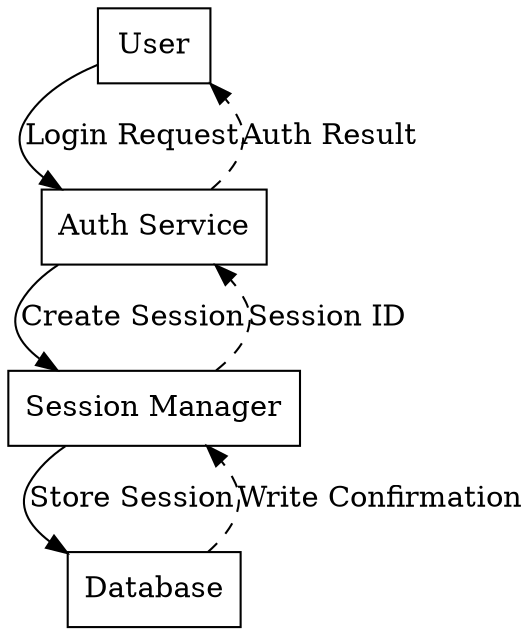

# STPA Step 2: Model the Control Structure

## Objective

Create a hierarchical model showing:
- **Controllers** (humans, software, hardware that make decisions)
- **Control Actions** (commands sent to controlled processes)
- **Feedback** (information returned to controllers)
- **Controlled Processes** (entities being controlled)

## Announce at Start

"I'm using the STPA Step 2 skill to model the control structure. We'll identify controllers, control actions, and feedback paths."

## Key Concepts

### What is a Control Structure?

A control structure shows the **hierarchical relationships** between:
- Higher-level controllers that set goals/constraints
- Lower-level controllers that implement those constraints
- Controlled processes that execute actions
- Feedback loops that provide information back up

### Why Control Structures?

- Traditional dataflow diagrams don't show control hierarchy
- STPA focuses on **feedback paths** often neglected in design
- Abstracts complex systems to **10-15 manageable boxes**
- Narrows search from millions of lines of code to specific decisions

## Phase 1: Identify Controllers

### Questions to Ask

**Q1: Who or what makes control decisions in this system?**
- Human operators/users
- Software components (services, modules, agents)
- Hardware controllers (PLCs, microcontrollers)
- External systems that provide input

**Q2: What is the hierarchy of control?**
- Which controllers give commands to others?
- Who has override authority?
- What is the chain of command?

### Controller Examples

**Software System:**
- API Gateway, Authentication Service, Database Controller, User

**Physical System:**
- Plant Manager, Control Room Operator, PLC, Valve Actuator

**AI System:**
- Human Operator, Orchestrator, ML Model, Action Executor

## Phase 2: Identify Control Actions

### Questions to Ask

**Q1: What commands does [Controller] send to [Controlled Process]?**
- Start/Stop commands
- Configuration changes
- Data modifications
- Enable/Disable actions

**Q2: When are these control actions sent?**
- On user request
- On schedule
- In response to feedback
- Based on system state

### Control Action Examples

| Controller | Control Action | Controlled Process |
|------------|---------------|-------------------|
| User | Submit Login | Auth Service |
| Auth Service | Issue Token | Session Manager |
| Orchestrator | Execute Task | ML Model |
| PLC | Open Valve | Pressure Vessel |

## Phase 3: Identify Feedback Paths

### Questions to Ask

**Q1: What information does [Controlled Process] send back to [Controller]?**
- Status information (running, stopped, error)
- Measurement data (temperature, pressure, counts)
- Acknowledgments (success, failure)
- Alerts and warnings

**Q2: How does the controller use this feedback?**
- To verify actions completed
- To adjust future control actions
- To detect anomalies
- To report to higher-level controllers

### Common Missing Feedback

- Confirmation that action was received
- Confirmation that action was executed correctly
- Confirmation that desired effect was achieved
- Time taken to complete action

## Graphviz/DOT Template



## Diagram Conventions

### Layout
- `rankdir=TB` - Top to bottom flow
- Higher authority at top, controlled processes at bottom

### Node Style
- `node [shape=box]` - All nodes are rectangular boxes
- Clear, descriptive labels

### Edge Style
- **Solid arrows**: Control actions (pointing down/to controlled)
- **Dashed arrows**: Feedback (pointing up/to controller)
- **Labels**: Describe what is being communicated

## Validation Questions

Before proceeding to Step 3:

**Q1: Is every controller-controlled relationship shown?**
**Q2: Does every control action have corresponding feedback?**
**Q3: Are there any hidden controllers we haven't identified?**
**Q4: Are there any feedback paths that are missing or delayed?**

## Output Template

Record in .sgai/PROJECT_MANAGEMENT.md:

```markdown
### Step 2: Control Structure

#### Controllers Identified
1. [Controller 1] - [Role/Description]
2. [Controller 2] - [Role/Description]

#### Control Structure Diagram

```dot
digraph ControlStructure {
    rankdir=TB;
    node [shape=box];

    // [Insert diagram here]
}
```

#### Control Actions Table

| Controller | Control Action | Controlled Process | Feedback |
|------------|---------------|-------------------|----------|
| [C1] | [Action] | [C2] | [Feedback] |

#### Notes
- [Any gaps or concerns about feedback paths]
- [Areas where control is unclear]
```

## When to Proceed to Step 3

Move to Step 3 when:
- [ ] All controllers are identified and placed in hierarchy
- [ ] All control actions are documented
- [ ] All feedback paths are identified (or gaps noted)
- [ ] Human partner confirms the structure looks accurate

Load: `skills({"name":"stpa/step3-unsafe-control-actions"})`
