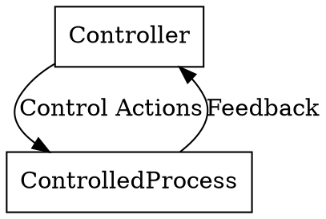

# STPA Overview

## What is STPA?

STPA (System Theoretic Process Analysis) is a hazard analysis method that:
- Treats safety as a **control problem**, not just a failure problem
- Uses **control-feedback loops** to model complex systems
- Identifies **unsafe control actions** that could lead to hazards
- Discovers complex, unintended system interactions
- Works on **software**, **physical**, and **AI-driven** systems

## Applicability

STPA applies to any system that can be modeled as a control problem:

- **Software Systems**: Software architectures, APIs, microservices, distributed systems
- **Physical Systems**: Hardware, manufacturing processes, mechanical/electrical systems
- **AI Systems**: AI-driven applications, ML pipelines, autonomous decision-making systems
- **Control Theory**: Any system with control-feedback loops and hierarchical control structures

## Key Concepts

- **Losses**: Unacceptable outcomes (system failure, data loss, safety incidents, financial harm)
- **Hazards**: System states that could lead to losses when combined with worst-case environmental conditions
- **System-Level Constraints**: Behaviors the system must exhibit to prevent hazards
- **Control Structure**: Hierarchical model of controllers, control actions, and feedback paths
- **Unsafe Control Actions (UCAs)**: Control actions that lead to hazards. Four types:
  1. Not provided when needed
  2. Provided when not needed
  3. Provided too early, too late, or out of sequence
  4. Provided for wrong duration (stopped too soon or applied too long)
- **Loss Scenarios**: Causal pathways that explain why unsafe control actions might occur

## Announce at Start

"I'm using the STPA Overview skill to guide you through a systematic hazard analysis. We'll work through 4 steps, asking questions along the way."

## Operating Principles

### Interactive Questioning
- Ask **ONE question at a time** - do not overwhelm with multiple questions
- Use **multiple choice** when possible to make responses easier
- **Wait** for the human partner's response before proceeding to the next question
- Use `ask_user_question` to hand control back to the human partner
- Never assume answers - always ask and confirm

### Step-by-Step Process
At each step:
1. Load the step-specific skill
2. Ask one question at a time
3. Use `ask_user_question` to present questions and wait for responses
4. Record answers in .sgai/PROJECT_MANAGEMENT.md under `## STPA Analysis`
5. Continue to next question or step

### Documentation
- Record all analysis results in .sgai/PROJECT_MANAGEMENT.md under `## STPA Analysis`
- Summarize findings in GOAL.md under `## STPA Findings`
- Use Graphviz/DOT for control structure diagrams

## The 4 Steps

### Step 1: Define Purpose of Analysis
Load: `skills({"name":"stpa/step1-define-purpose"})`
- Identify **Losses** (unacceptable outcomes)
- Define **System-Level Hazards** (states leading to losses)
- Establish **System-Level Constraints** (behaviors to prevent hazards)

### Step 2: Model the Control Structure
Load: `skills({"name":"stpa/step2-control-structure"})`
- Create hierarchical control-feedback diagrams
- Identify controllers, control actions, and feedback paths
- Use Graphviz/DOT format with `rankdir=TB` and `node [shape=box]`

### Step 3: Identify Unsafe Control Actions (UCAs)
Load: `skills({"name":"stpa/step3-unsafe-control-actions"})`
- Analyze each control action for 4 types of UCAs:
  1. Not provided when needed
  2. Provided when not needed
  3. Wrong timing (too early/late/out of sequence)
  4. Wrong duration (stopped too soon/applied too long)

### Step 4: Identify Loss Scenarios
Load: `skills({"name":"stpa/step4-loss-scenarios"})`
- Trace causal pathways for each UCA
- Identify why UCAs might occur
- Develop recommendations and mitigations

## Process Flow

```
[Step 1: Purpose] -> [Step 2: Control Structure] -> [Step 3: UCAs] -> [Step 4: Scenarios]
       ^                                                                      |
       +------------------------ (Iterate as needed) -------------------------+
```

## Diagram Standards (Graphviz/DOT)

Use the following basic template for control structure diagrams. For detailed diagram guidance, see the Step 2 skill: `skills({"name":"stpa/step2-control-structure"})`.



## Documentation Structure

### In .sgai/PROJECT_MANAGEMENT.md:
```markdown
## STPA Analysis

### Step 1: Purpose Definition
#### Losses (L)
- L-1: [description]

#### Hazards (H)
- H-1: [system] [unsafe condition] [-> L-1]

#### System-Level Constraints (SC)
- SC-1: [condition to enforce] [-> H-1]

### Step 2: Control Structure
[Graphviz/DOT diagram]

### Step 3: Unsafe Control Actions
[UCA table]

### Step 4: Loss Scenarios
[Scenario descriptions and recommendations]
```

### In GOAL.md (final summary):
```markdown
## STPA Findings
- [X] STPA analysis completed on [date]
- Key hazards identified: [count]
- Unsafe control actions found: [count]
- Critical recommendations: [list]
```

## When Analysis is Complete

After completing all 4 steps:
1. Summarize findings in GOAL.md under `## STPA Findings`
2. Mark the STPA analysis checkbox as complete
3. Set `status: "agent-done"` to return control

## Remember

- Safety is a **control problem**, not just a failure problem
- Focus on **feedback paths** - they are often neglected in software design
- Control structures abstract complex systems to manageable **~10-15 boxes**
- STPA narrows search from millions of lines of code to **specific control decisions**

## Related Skills

- `stpa-step1-define-purpose` - Detailed Step 1 guidance
- `stpa-step2-control-structure` - Control structure modeling
- `stpa-step3-unsafe-control-actions` - UCA identification tables
- `stpa-step4-loss-scenarios` - Causal scenario analysis
